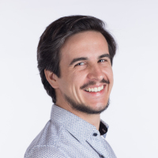
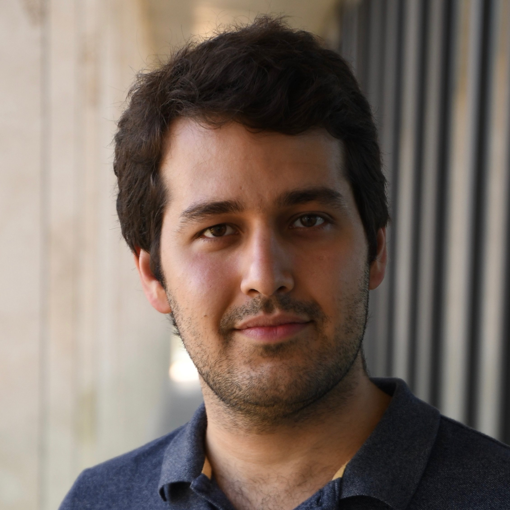
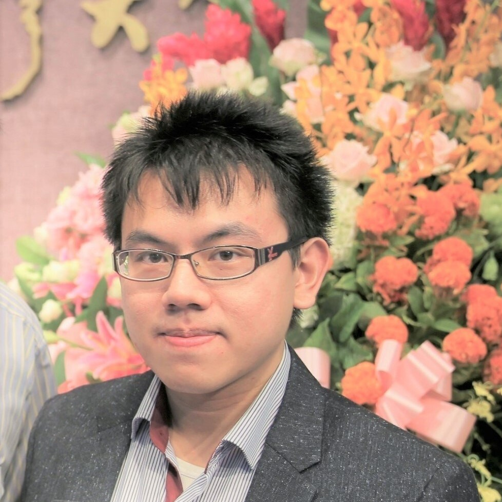
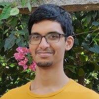
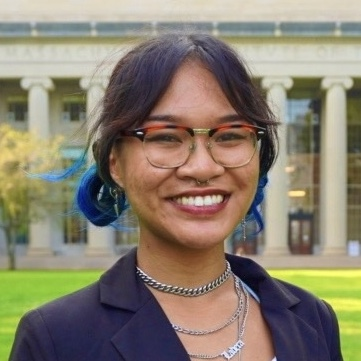
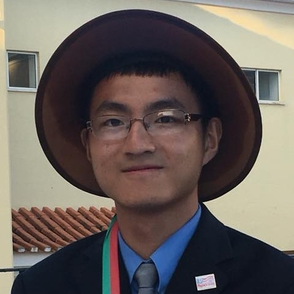
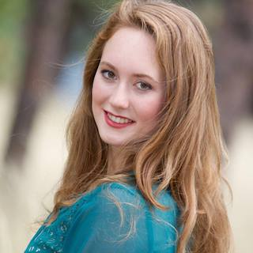
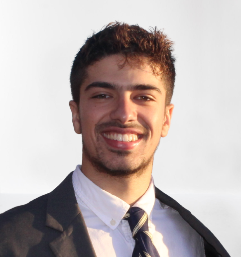
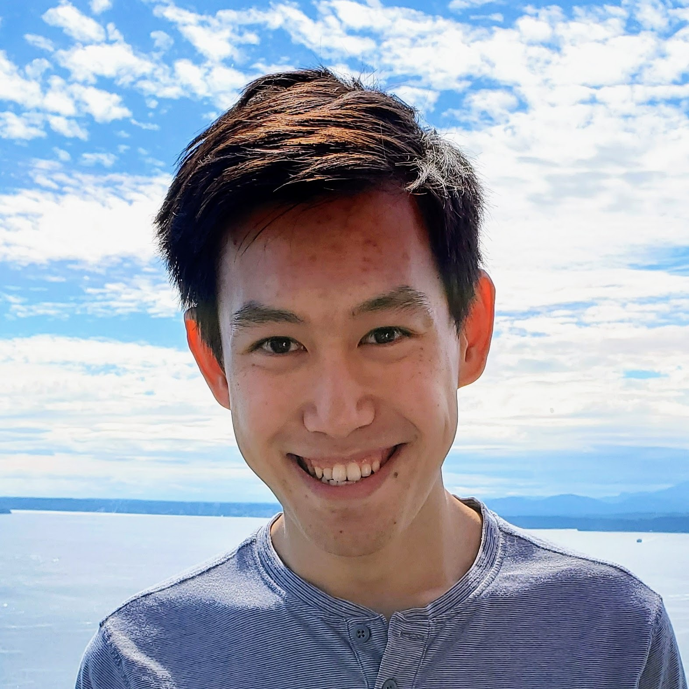

<table style="width:100%">
<tr>
  <td width="150">
  
   
  <h3><a href="https://blondegeek.github.io/" title="Tess is a physicist obsessed with the geometry of atomic systems. She will use any and all tools to understand it -- from first-principle calculations and neural networks to D&D dice and parameteric computer models. Tess is an Assistant Professor in EECS at MIT and heads the Atomic Architects.">Tess Smidt</a>  Principal Investigator</h3>  
  <a href="mailto:tsmidt@mit.edu">Email</a>
  </td>
 <td width="150">
  
   
  <h3><a href="https://www.rle.mit.edu/people/directory/catherine-bourgeois/" title="">Cathy Bourgeois</a> RLE Program Manager & Interim Admin. Asst.</h3>
  <a href="mailto:cmbourg@mit.edu">Email</a>
  </td>
 <td width="150">
  
   
  <h3><a href="https://mariogeiger.ch/" title="Mario works on neural networks. When not at Berkeley Lab, he lives in Switzerland. His favorite ice cream flavor is pistachio. Mario is the BDFL of e3nn, a framework for neural networks with Euclidean symmetry.">Mario Geiger</a> Postdoctoral Scholar</h3>  
  <a href="mailto:mgeiger@mit.edu">Email</a>
  </td>
 <td width="150">
  
   
  <h3><a href="https://scholar.google.com/citations?user=NMFJ8y8AAAAJ&hl=en" title="">Aria Mansouri Tehrani</a> Postdoctoral Scholar</h3>  
  <a href="ariamt@mit.edu">Email</a>
  </td>
</tr>
<tr style="background-color:#F0E2E7">
 <td width="150">
  
   
  <h3><a href="" title="">Yi-Lun Liao</a> PhD Student</h3> 
  <a href="ylliao@mit.edu">Email</a>
  </td>
 <td width="150">
  
   
  <h3><a href="https://ameya98.github.io/" title="">Ameya Daigavane</a> PhD Student</h3>
  <a href="ameyad@mit.edu">Email</a>
  </td>
 <td width="150">
  
   
  <h3><a href="https://www.linkedin.com/in/adriana-ladera-84b18a171/" title="Hey friends, I'm Adriana, a graduate student in MIT's Computational Science and Engineering program! My research interests are numerical methods and algorithms, high-performance scientific computing, modeling and simulation, and computational geometry. With Tess, I'm interested in studying and creating novel molecular structures with the help of generative models and physics-informed insight (how I'm going to do that... I'll find out eventually). I completed my B.S. in computer science with a minor in physics at the University of South Florida, and am also a 2022 recipient of the NSF Graduate Research Fellowship! Outside of the lab (aka my computer), I enjoy playing piano, going out with friends, doing funky calisthenics, rock climbing, and creating meme art. I also have a fascination with eggs and egg-shaped things, so please send me a photo of those if you find any >:D">Adriana Ladera</a> SM Student</h3>
  <a href="aladera@mit.edu">Email</a>
  </td>
 <td width="150">
  
   
  <h3><a href="" title="I have written a truly marvelous bio which this space is too small to contain.">YuQing Xie</a> PhD Student</h3>
  <a href="xyuqing@mit.edu">Email</a>
  </td>
</tr>
<tr>
 <td width="150">
  
   
  <h3><a href="https://www.linkedin.com/in/elyssa-hofgard12/" title="I'm currently a first year EECS PhD student. I'm from Louisville, Colorado and I did my master's degree and undergrad at Stanford University. I'm excited to use machine learning to help us understand and design physical systems! In my free time, I like to ski, hike, read, and explore Boston! ">Elyssa Hofgard</a> PhD Student</h3>
  <a href="ehofgard@mit.edu">Email</a>
  </td>
 <td width="150">
  
   
  <h3><a href="" title="">Allan Costa</a> PhD Student</h3> 
  <a href="allanc@mit.edu">Email</a>
  </td>
<td width="150">
  
 
<h3><a href="https://songkim.me" title="">Song Kim</a> Undergraduate Student</h3>
  <a href="songk@mit.edu">Email</a>
</td>
<td width="150">
  
 
<h3><a href="#" title="">Tuong Phung</a> Undergraduate Student</h3>
  <a href="tphung@mit.edu">Email</a>
</td>
</tr>
</table>

## Alumni

### <a href="https://www.linkedin.com/in/klsky/">Kostiantyn Lapchevskyi</a> (<a href="https://atomicarchitects.github.io/assets/img/koctya_with_duck_small.jpg">photo</a> | <a href=" " title="Applied physicist turned ML engineer pursuing a dream to build ‘The Blue Police Box’ one day.">hover for bio</a>)
Then: Masters Student at the Ukranian Catholic University

### <a href="http://mathben.com/">Ben Miller</a> (<a href="https://atomicarchitects.github.io/assets/img/ben_with_duck_small.jpg">photo</a> | <a href=" " title="Ben relied on physical intuition to get through his undergrad and enjoys learning how to make that physical intuition mathematically precise. He is studying the intersection of statistics, physics, and chemistry at the Freie Universität in Berlin. Specifically, he spends his time creating neural network models which learn using geometry. These days, Ben lies awake thinking about the broad landscape of neural network applications and how they manage to learn at all.">hover for bio</a>)
Then: Masters Student at FU Berlin
 
Now: PhD Student at the University of Amsterdam

### <a href="https://www.linkedin.com/in/hashim-piracha-65118116b/">Hashim Piracha</a> (<a href="https://atomicarchitects.github.io/assets/img/hashim_with_duck_small.jpg">photo</a> | <a href=" " title="Joining the team as an undergraduate from UC Berkeley, Hashim can often be spotted calculating tensor products of spherical harmonic signals, clustering atomic datasets, and jamming to Pakistani music. Whilst sipping cups of chai, he applies dimensionality reduction techniques such as t-SNE and PCA to visualize high dimensional data. Note: It is said that the more chai he drinks, the more efficient he becomes."> hover for bio</a> ) {#hashim} 
Then: Undergraduate Research Assistant 
 
Now: Undergraduate at UC Berkeley

### <a href="https://elliottperryman.vivaldi.net">Elliott Perryman</a> (<a href="https://atomicarchitects.github.io/assets/img/elliott_with_duck_small.jpg">photo</a> | <a href=" " title="Elliott is an undergraduate student studying computer science and physics and working at LBL through the SULI program. Elliott is from the Mule Capital of the world and enjoys running with friends, reading by the fireplace, and a maximally efficient line of Python."> hover for bio</a> ) {#elliott}
Then: Undergraduate Research Assistant
 
Now: Undergraduate at The University of Tennessee, Knoxville

## What's with the rubber ducks?
When someone joins the Atomic Architects, they get a <a href="https://en.wikipedia.org/wiki/Rubber_duck_debugging">debugger duck</a>.
